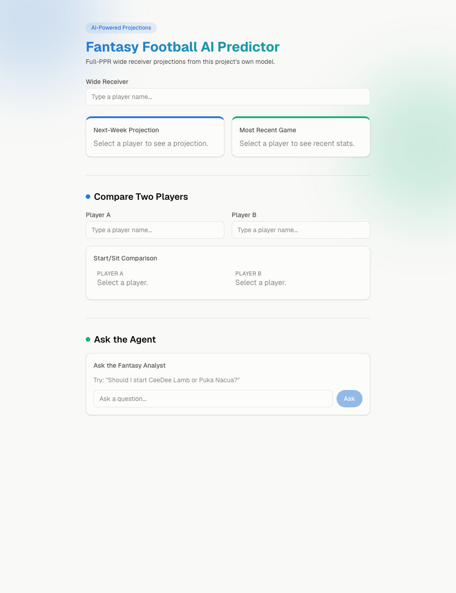
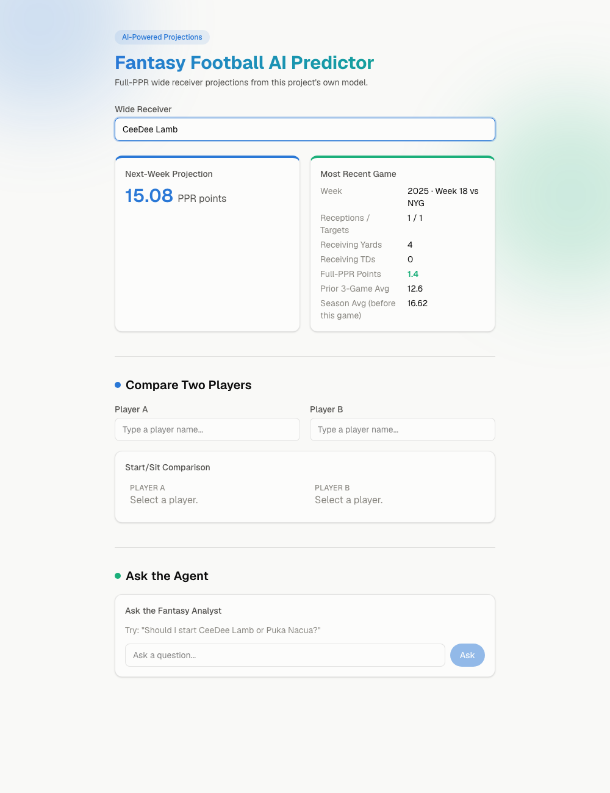
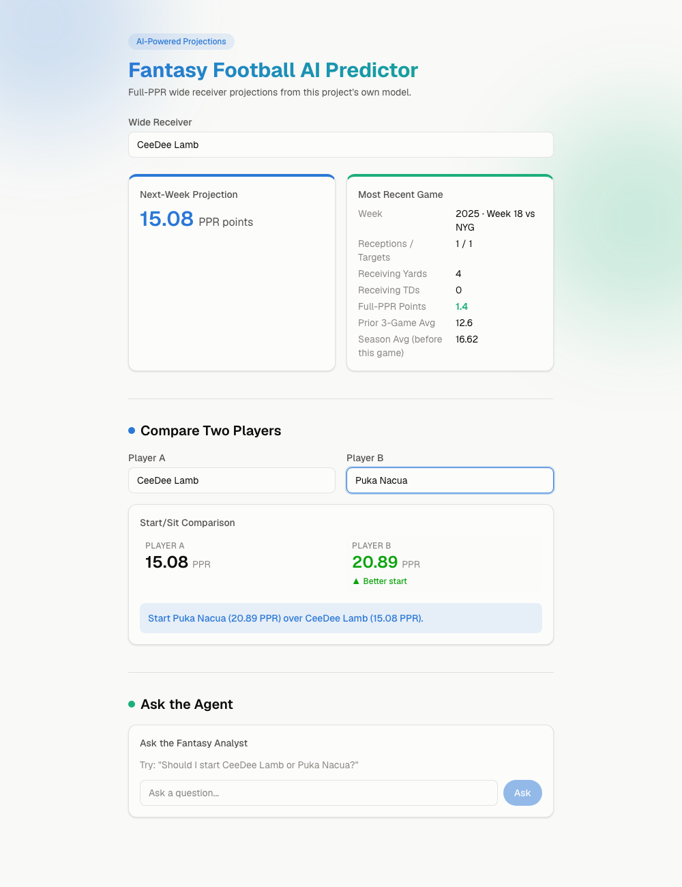
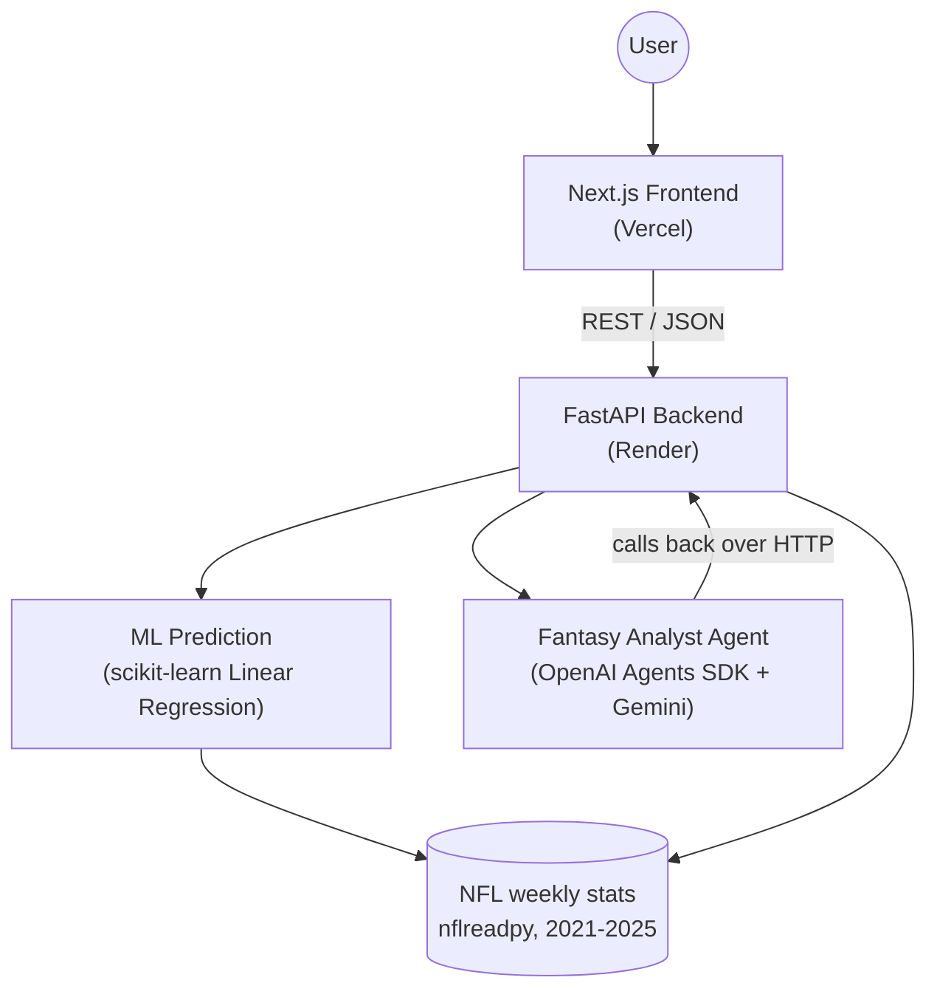

# Fantasy Football AI Predictor

A full-stack project that predicts an NFL wide receiver's next-week full-PPR fantasy
points from historical data, using a measured machine-learning model (not vibes), and
a tool-using AI agent that answers questions grounded in that same model — never by
inventing numbers.

**Live demo:** https://fantasy-football-project-ten.vercel.app
**API:** https://fantasy-football-api-o6tu.onrender.com/health

> The backend is hosted on Render's free tier, which spins down after ~15 minutes of
> inactivity. The first request after a while can take 30-60 seconds (or fail once and
> succeed on retry) while it wakes back up — that's expected, not a bug.

## Screenshots

| Landing page | Projection + recent stats |
|---|---|
|  |  |

| Two-player comparison |
|---|
|  |

## What it does

- **Search a WR** by name (typeahead, not a giant dropdown)
- **Next-week full-PPR projection** from a trained regression model
- **Recent-game stats** plus the rolling/season averages the model actually uses
- **Two-player start/sit comparison** — computed deterministically, not by an LLM
- **Ask the Fantasy Analyst** — a natural-language agent that calls the same
  deterministic tools as the rest of the app (it cannot invent a projection; every
  answer traces back to a real tool call, shown in the UI as "Tools used: ...")

## Architecture



Both the ML path and the agent path are backed by the same processed data and the same
deterministic tools — the agent has no separate source of truth, and no ability to
calculate a projection on its own.

## Tech stack

| Layer | Tech |
|---|---|
| Data | [nflreadpy](https://github.com/nflverse/nflreadpy), Polars |
| ML | scikit-learn (Linear Regression), joblib |
| Backend | FastAPI, Pydantic, Uvicorn |
| Agent | OpenAI Agents SDK, running on Gemini (via its OpenAI-compatible endpoint) |
| Frontend | Next.js (App Router), TypeScript, Tailwind CSS |
| Hosting | Vercel (frontend), Render (backend) |

## Model methodology

- **Scope:** wide receivers only, regular-season games, 2021-2025.
- **Scoring:** a custom full-PPR formula (reception = 1pt, receiving/rushing yard =
  0.1pt, receiving/rushing TD = 6pt, fumble lost = -2pt), implemented in
  [`src/scoring.py`](src/scoring.py).
- **Features** (all shifted to only use information available *before* the
  predicted week, to prevent data leakage):
  - previous 3-game rolling average PPR, targets, receptions, receiving yards
  - season-to-date average PPR (resets each season)
  - opponent defense's prior average PPR allowed to WRs
- **Evaluation:** a temporal split — train on seasons before 2025, test on the 2025
  regular season — not a random split, since NFL data is ordered in time.
- **Baselines:** a rolling 3-game average and a season-to-date average, both measured
  before any model was trained, so the model has something honest to beat.

## Model performance

Measured on the 2025 regular season test set (lower is better):

| Model | MAE | RMSE |
|---|---|---|
| Rolling 3-game average (baseline) | 4.56 | 6.41 |
| Season-to-date average (baseline) | 4.45 | 6.27 |
| **Linear Regression (used in production)** | **4.39** | **6.00** |
| Random Forest (evaluated, not used) | 4.46 | 6.12 |

Linear Regression modestly beats both baselines and was more consistent than Random
Forest on this split, but the margin over the season-to-date baseline is small — this
should be read as "a measurable, honest improvement," not "a solved problem." The
model's largest errors, in every version tested, come from unpredictable spike-week
performances (a normally low-usage receiver having one huge game), which no version of
this feature set fully captures.

## Project structure

```
fantasy-football-project/
├── src/                  # reusable application code
│   ├── data.py           # load/filter weekly WR stats
│   ├── scoring.py         # full-PPR scoring formula
│   ├── features.py        # rolling/season/defensive features
│   ├── modeling.py        # train/evaluate/save/load the model
│   ├── predict.py         # single-player projection helper
│   ├── api.py             # FastAPI app
│   └── agent.py           # Fantasy Analyst Agent + tools
├── notebooks/             # exploration and model-development notebooks
├── tests/                 # one test script per src/ module
├── frontend/              # Next.js app
├── models/                # trained model artifact (gitignored, regenerated)
├── render.yaml             # Render deploy config
└── requirements-render.txt # minimal deploy-only dependency list
```

## Running locally

**Backend:**

```bash
python -m venv .venv && source .venv/bin/activate
pip install -r requirements.txt
echo "GEMINI_API_KEY=your-key-here" > .env
uvicorn src.api:app --reload --port 8000
```

**Frontend** (in a second terminal):

```bash
cd frontend
npm install
echo "NEXT_PUBLIC_API_BASE_URL=http://127.0.0.1:8000" > .env.local
npm run dev
```

Then open http://localhost:3000.

## Testing

Each `src/` module has a matching assertion-based test script:

```bash
PYTHONPATH=. python tests/test_scoring.py
PYTHONPATH=. python tests/test_features.py
PYTHONPATH=. python tests/test_modeling.py
PYTHONPATH=. python tests/test_predict.py
PYTHONPATH=. python tests/test_data.py
PYTHONPATH=. python tests/test_api.py
PYTHONPATH=. python tests/test_agent.py
```

All API/agent tests mock network calls and the LLM, so the suite runs offline with no
API cost. CI (`.github/workflows/tests.yml`) runs all seven on every push/PR.

## Deployment

- **Backend (Render):** `render.yaml` defines the service; `requirements-render.txt`
  is a minimal dependency list (the root `requirements.txt` is a full local-dev
  environment freeze, including Jupyter tooling the deployed API doesn't need).
  The backend trains and saves a fresh model at startup if none exists on disk,
  since `models/` is gitignored.
- **Frontend (Vercel):** deployed from the `frontend/` directory, configured via
  `NEXT_PUBLIC_API_BASE_URL`.
- CORS on the backend allows `localhost`, an explicit `ALLOWED_ORIGINS` env var, and
  (via a scoped regex) any Vercel preview deployment of this specific project.

## Roadmap

The MVP (data → scoring → baseline → ML → API → agent → frontend → deployment) is
complete for wide receivers. Planned next: extending the same pipeline to running
backs, then tight ends and quarterbacks (quarterbacks need new scoring categories —
passing yards/TDs/interceptions — that don't exist in the current formula yet). See
`PROJECT_CONTEXT.md` for the full roadmap and decision history.

## About this project

Built as a learning + portfolio project to practice the full path from raw data to a
deployed, agentic AI application:

- Built a full-PPR fantasy scoring engine and prediction-safe feature pipeline from
  raw NFL play-by-play stats, validated against two measured baselines
- Trained and evaluated a Linear Regression model against Random Forest using a
  temporal train/test split, with all metrics measured (not assumed)
- Built a FastAPI backend and a tool-using AI agent (OpenAI Agents SDK) where the LLM
  can reason and explain, but every number it states comes from a deterministic tool
  call — verified live, not just designed that way
- Built and deployed a Next.js frontend end to end (Vercel + Render), including
  fixing a real CORS/config/build issues encountered during actual deployment
